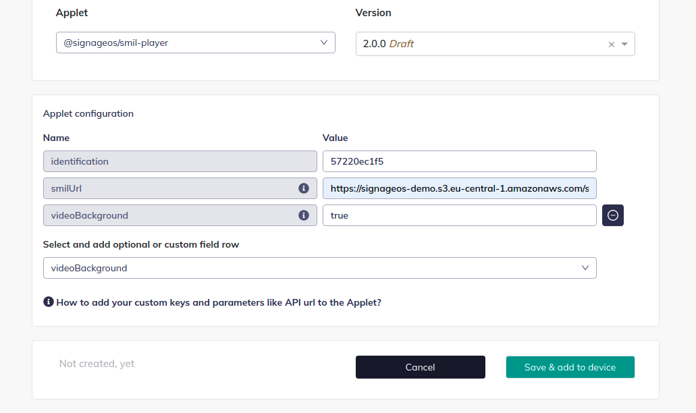

# Video

signageOS SMIL Player supports multimedia objects, including videos, images, streams, video inputs, HTML5 widgets and
HTML5 websites.

## Basic usage

A simple video played for its entire duration.

```xml

<video src="https://demo.signageos.io/smil/zones/files/video_1.mp4"/>
```

To ensure your video will be played, check
the [supported video files formats and codecs](https://docs.signageos.io/hc/en-us/articles/4405387474322) by your
devices.

### Using Query Parameters

You can include query parameters in video URLs for dynamic content selection, tracking, or versioning. Each unique URL with different query parameters will be cached separately.

```xml
<!-- Videos with different query parameters are cached separately -->
<video src="https://example.com/video?campaign=summer&amp;id=1" region="main"/>
<video src="https://example.com/video?campaign=summer&amp;id=2" region="main"/>

<!-- Using query parameters for analytics tracking -->
<video src="https://demo.signageos.io/video.mp4?source=playlist&amp;device=display1" 
       popName="video_event" popType="video" popTags="tracking"/>
```

**Note:** Remember to use `&amp;` instead of `&` for proper XML encoding when separating query parameters.

## Video duration

If you need to play part of your video, you can define dur attribute. Dur will cut the video playback after defined
number of seconds.

```xml

<video src="https://demo.signageos.io/smil/zones/files/video_1.mp4" dur="15s"/>
```

Without `dur`, the video plays until its natural end. Note the `dur` value must be a plain number of seconds
(optionally with the `s` suffix) — SMIL clock-values like `dur="3000ms"` or `dur="01:02:03"` are **not** supported and
will be misread as seconds.

## Videos in Background

Do you need to play a **video in background**? The possibility to play videos in the background is currently under
review. As of now, you can work around the missing layering by forcing all videos to run in the background.

*Known limitations: you cannot layer videos on top of each other.*

## Set videos to play in the background in configuration

You can configure SMIL Player with several parameters including forcing the background video playback.

In the Applet configuration set `videoBackground` to `true`.



Learn more about [Applet configuration here](https://docs.signageos.io/hc/en-us/articles/4405238989458).

Setting `videoBackground: "true"` requires no rebuild — the player reads it from the applet configuration at startup.
With it enabled, videos play on the background video plane and images/widgets can be layered above them (you still
cannot layer videos on top of each other).
